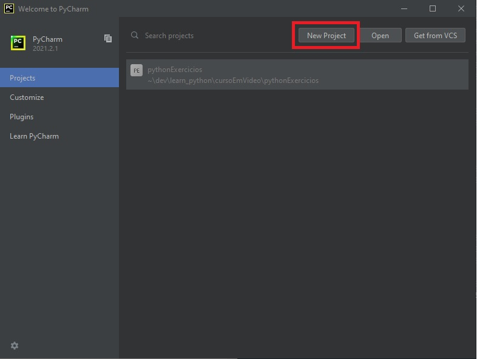
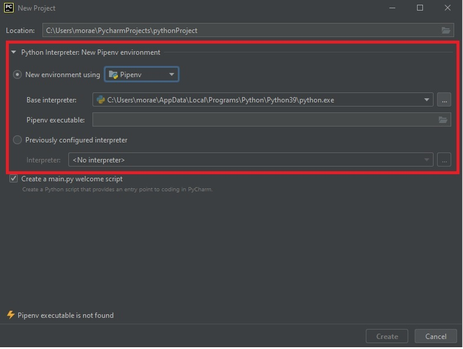
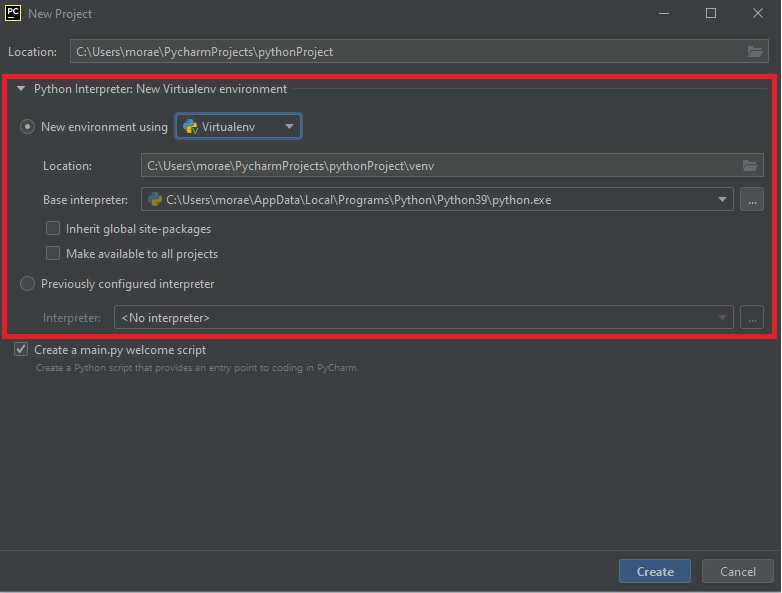
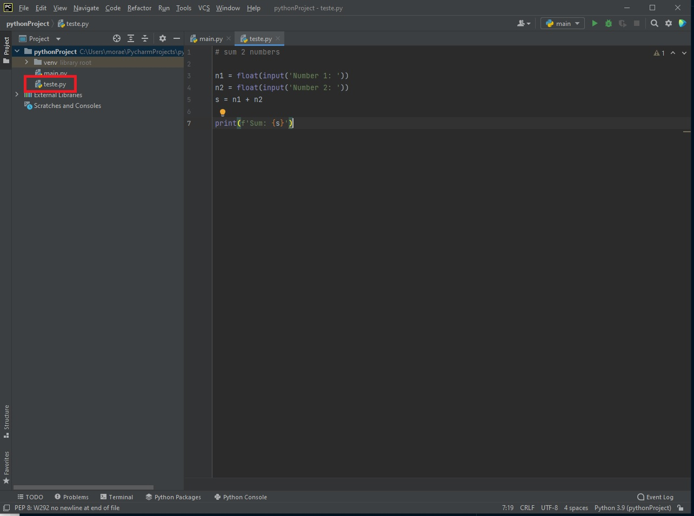
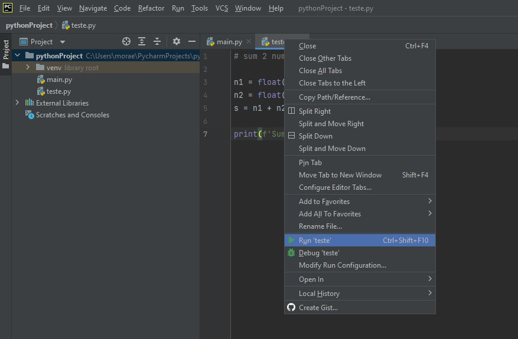
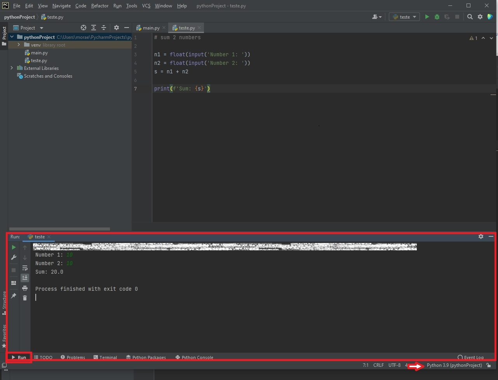

    Agora vamos utilizar o pycharm que voce instalou no passo 2.3.1 Instalando pycharm para criar um novo projeto, vamos programar e executar um arquivo python.

* Comece abrindo o pycharm, em seguida cliquem em "New Project".

* Selecione o interpretador que vc deseja e click em create.

* Crie um novo arquivo python('file_name.py').

* Execute o arquivo. Para executar o arquivo clique com o botao direito no nome do arquivo e clique -> Run 'file_name.py'

* Após executar o arquivo irá aprecer uma nova janela mo canto inferior da tela com a execuçao do seu codigo, essa janela se chama 'Run' voce pode verificar ao lado esquerdo, voce tambem pode observar qual interptretador voce está utilizando ao lado direito. 
