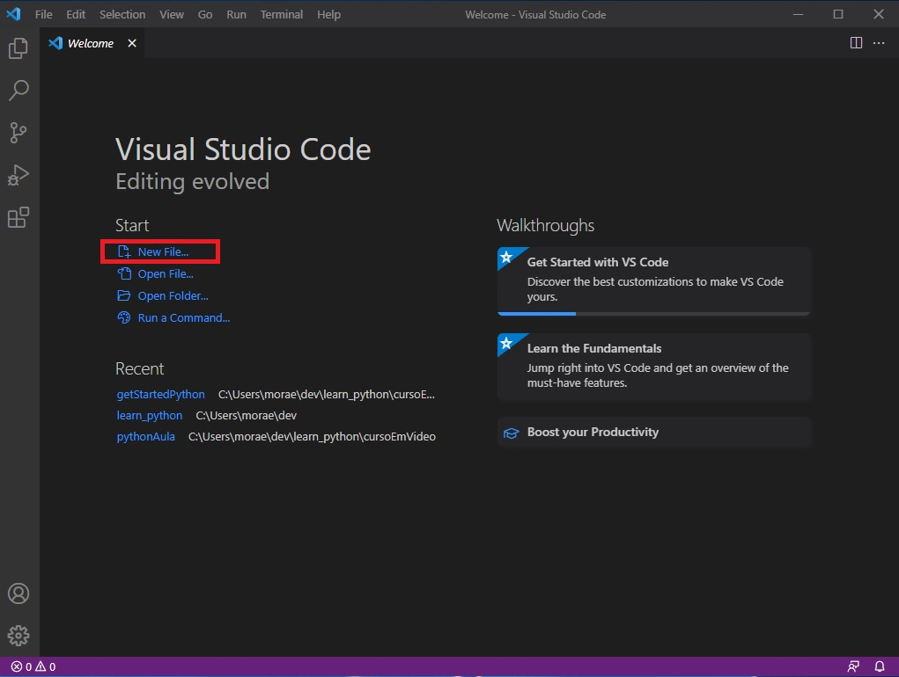
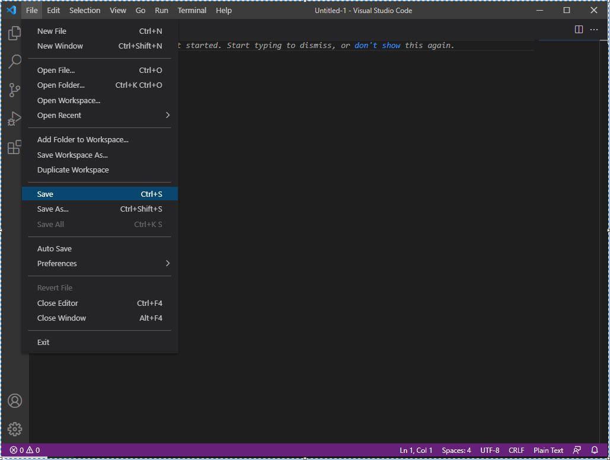
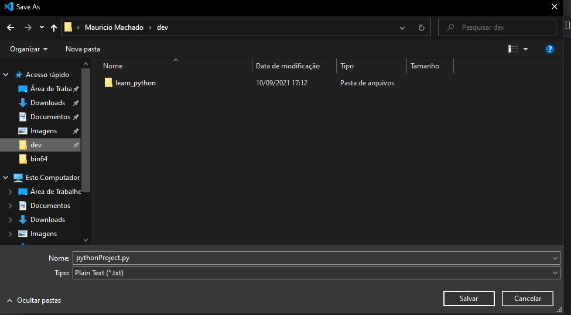
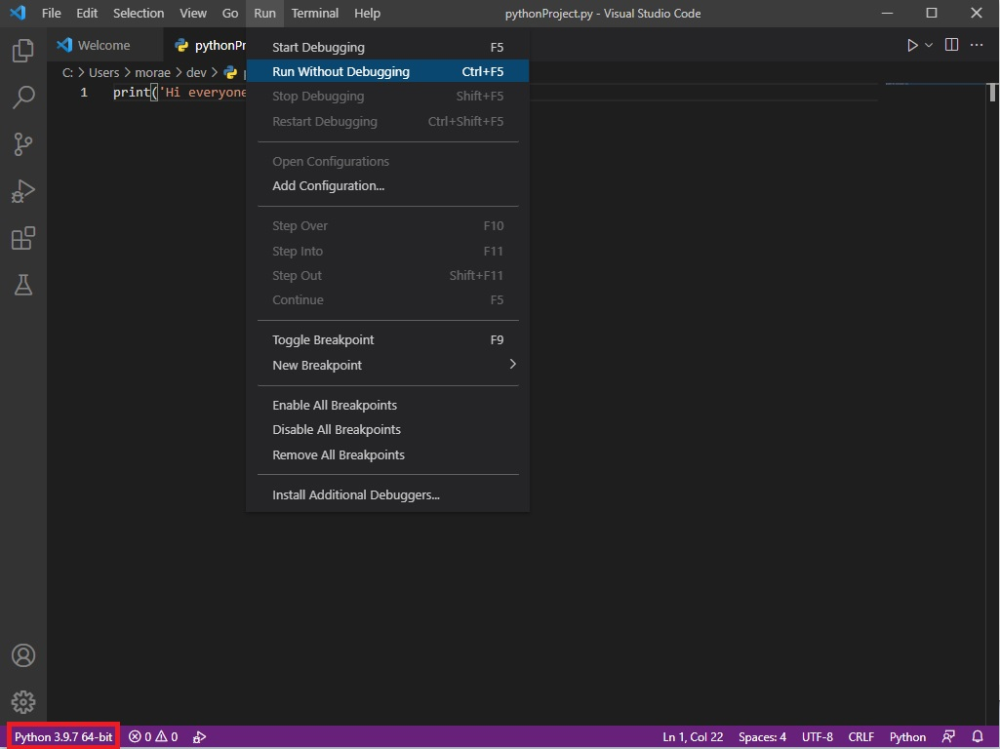
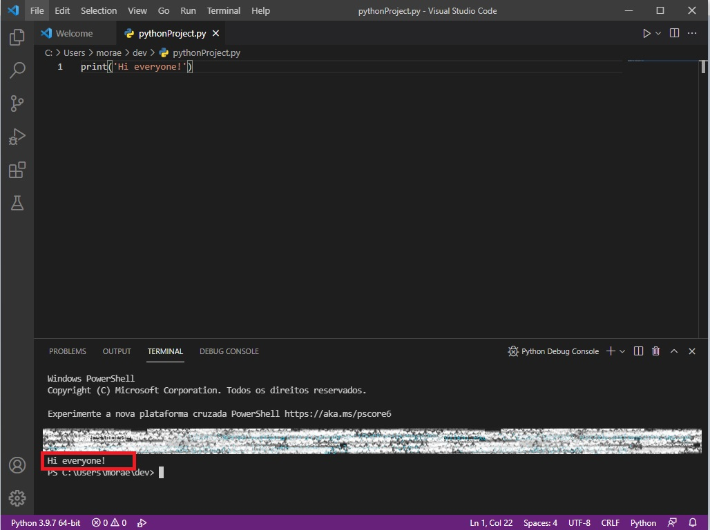

    Agora vamos utilizar o vscode que voce instalou no passo 2.3.2 Instalando vscode para criar um novo projeto, vamos programar e executar um arquivo python.

* Comece abrindo o vscode, em seguida cliquem em "New File".

* Salve o arquivo.

* Salve o arquivo com o nome 'file_name.py'.

* Execute o arquivo. Para executar o arquivo clique no menu 'Run' -> 'Run Without debugging'. Voce tambem pode notar no canto inferior esquerdo qual interpretador voce está utilizando.

* Após executar o arquivo irá aprecer uma nova janela no canto inferior da tela com a execuçao do seu codigo.
